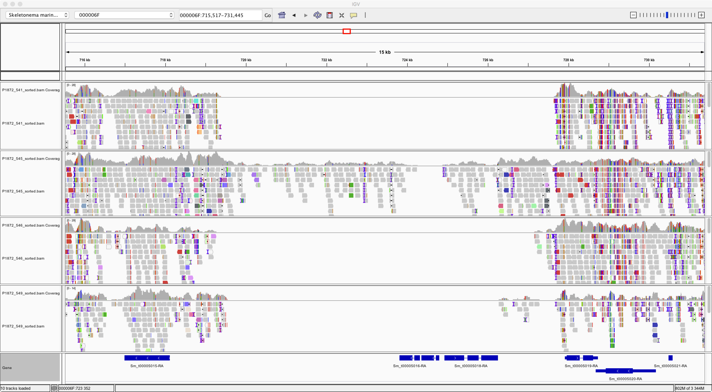

# Introduction
When analysing some resequences strains collected from sediment cores in Mariagerfjord, Sweden, I came across this phenomenon, where part of the genome seems to be missing in some of the strains. 

Interestingly, the missing region contains two gene models, and these genes would therefore be missing from the effected strains. In this repository we are analysing the coverage on the predicted genemodels (in BED format) i all the resequenced strains we have available, to find out the pangenome of Skeletonema marinoi.

